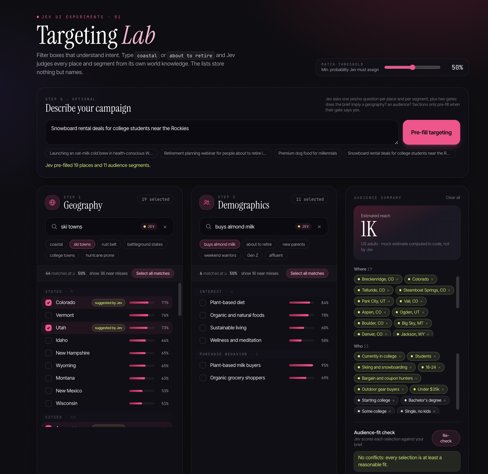

# Jev UI Playground

**Live: [jev-ui.newtricks.ai](https://jev-ui.newtricks.ai)**. The landing page links to each experiment: the [Targeting Lab](https://jev-ui.newtricks.ai/targeting) and [Self-aware Tables](https://jev-ui.newtricks.ai/tables).

Jev's latency and cost are such that you can start to imagine including calls to an AI model inside your browser interaction event loop. This repo is a playground for exploring these concepts: semantic search filtering, intelligent geographic and demographic selection, and more.

The core idea is that much of the intelligence we used to write into UI code can now move out of our code and into calls to [Jev](https://typesafe.ai). Consider a location picker. It usually ships with hand-built metadata: region tags, "is coastal" flags, synonym tables. Here the picker only knows place names. When you type "coastal" or "ski towns", Jev decides which places match, using its own world knowledge.

The thought experiment behind the repo is this:

> What if the controls themselves were semantically aware and had intelligence?

Taken to the limit, you get a UI toolkit whose widgets take cues from their surroundings:

- A list view that understands the data it holds.
- A button that knows what its label promises.
- Controls that provide hints or auto-populate based on interactions with other controls.

Some of these ideas are deliberately ridiculous. That's the point. Taking them seriously pulls us past the first, obvious uses of Jev and toward what a semantically aware interface toolkit could be.



## The first experiment: ad targeting

The [Targeting Lab](https://jev-ui.newtricks.ai/targeting) (`/targeting`) is a mock ad-targeting setup screen. It has two pickers: US geography (51 states and DC, plus 323 cities) and audience demographics (184 segments across age, income, education, household, occupation, interests, life events and purchase behavior). The candidate lists contain **only names**. No attributes, tags or categories are stored.

- **Semantic filter boxes.** Type `coastal`, `rust belt`, `hurricane prone` or `college towns` in the geography box. Type `buys almond milk`, `about to retire` or `weekend warriors` in the demographics box. Jev scores every candidate against the query, and results are ranked by match probability. Exact name matches still work instantly. Near misses just below the threshold stay one click away.
- **Match threshold.** A slider sets the minimum probability a candidate needs to count as a match. Each result shows a confidence bar, so you can see how sure Jev is.
- **Campaign brief pre-fill.** Describe the campaign in plain English, for example "Snowboard rental deals for college students near the Rockies". Jev fills in both sections from the brief. Two gate questions ask whether the brief implies a geography and whether it implies an audience. A section is only pre-filled when its gate says yes, so "Premium dog food for millennials" sets an audience but leaves geography alone.
- **Audience-fit check.** Jev rates every selected place and segment against the brief on a four-level scale and flags the ones that don't fit.
- **Request inspector.** A drawer at the bottom shows each Jev call: the question count, input tokens, latency, estimated cost, and a sample of the request and answers.

## The second experiment: self-aware tables

[Self-aware Tables](https://jev-ui.newtricks.ai/tables) (`/tables`) is a browsable table of 347 movies. It explores filtering and sorting by attributes that aren't in the table. The table stores only title, year, genre and director, and Jev sees only "Title (Year)" for each movie.

- **Semantic row filter.** Type `funny and gory` and you get Shaun of the Dead, Zombieland, Tucker & Dale vs. Evil and Deadpool. `set in tokyo` finds Lost in Translation, Tokyo Story, Akira and Perfect Days. Plain text matches on any column (`star`, `tarantino`, `horror`) show instantly. Jev's matches join them after a pause in typing, with a match percentage for each row.
- **Jev-computed columns.** Add a column like `how scary`, `date-night friendly` or `OK for a 10-year-old`, and Jev rates every movie from "Not at all" to "Extremely". Added columns sort like any other column. The bar dims when Jev is less confident.
- **Combine them.** Filter to `set in tokyo`, then sort by `how scary`.

A filter query costs about 34k input tokens, roughly $0.0014, and returns in around 350 to 500 ms. An added column costs about 39k tokens, since each Score question is a little longer than a Noul.

## How it uses Jev

Everything goes through the [TypeSafe](https://typesafe.ai) System One API via `@typesafe-ai/sdk`.

- **One question per candidate, batched.** A filter query becomes one Noul (a yes/no probability) per candidate, sent together in a single request. The candidate's name goes inline in its question, as in `{ place: "Aspen, Colorado", question: "Does \`place\` match what \`filter\` describes?" }`, and the query itself goes in shared state. Inline labels proved far more accurate than asking Jev to index into a list held in state, and they use fewer tokens.
- **Gates before bulk work.** The brief endpoint asks Jev "does this brief imply a geography?" alongside the per-candidate questions, and it ignores that section's scores unless the gate passes.
- **Scores for graded judgments.** The fit check and the added table columns use a four-level Score instead of a Noul, because "how well does this fit?" or "how scary is it?" is a scale, not a yes/no.
- **Cheap enough to be a UI primitive.** A geography query scores all 374 places in about 37k input tokens. At Jev's $42 per billion input tokens that's roughly $0.0015, and it returns in around 300 to 500 ms. Demographics queries use about 19k tokens. Output tokens are free.

The server keeps the API key private. It also caches identical requests (LRU), rate-limits by IP, and caps input lengths. The client debounces typing, cancels stale requests, and merges local name matches with Jev's scores.

The Jev integration lives in `server/jev.ts` (batching and chunking) and `server/routes.ts` (the questions themselves).

## Tech stack

| Layer | Choice |
| --- | --- |
| Frontend | React 19, Vite, Tailwind CSS v4, Motion |
| API | Hono on Node (proxies Jev so the key stays server-side) |
| AI | Jev via `@typesafe-ai/sdk` |
| Language | TypeScript throughout, with shared request and response types in `src/shared` |
| Tooling | pnpm, ESLint, `concurrently` for the dev servers |
| Deploy | Docker, GitHub Actions, GHCR, [Porch](https://www.npmjs.com/package/@lindale/porch) with Caddy on a VPS |

```
src/
  App.tsx       Route table (path → page and document title)
  examples.ts   Example registry shown on the landing page
  pages/        Home (landing page), TargetingLab, SmartTable
  components/   SmartFilter, BriefBox, FitPanel, SummaryPanel, Inspector, ThresholdSlider
  data/         geo.ts, demographics.ts and movies.ts (names and plain facts only)
  lib/          Router, API client, filter and column hooks, inspector store, cost estimate
  shared/       Types shared by client and server
server/
  index.ts      Hono app: /api, /healthz, rate limit, static files in production
  routes.ts     /api/filter, /api/brief, /api/fit, /api/column
  jev.ts        Batches per-candidate questions into System One requests
```

## Running locally

You need Node 20 or newer, pnpm (`corepack enable`), and a TypeSafe API key.

```bash
pnpm install
cp .env.example .env    # then set TYPESAFE_API_KEY
pnpm dev
```

Open [http://localhost:5173](http://localhost:5173) for the landing page. The experiments are at [/targeting](http://localhost:5173/targeting) and [/tables](http://localhost:5173/tables). Vite serves the UI, and the Hono API runs on port 8787 behind Vite's `/api` proxy.

Optional settings in `.env`:

- `TYPESAFE_DEFAULT_MODEL` pins a Jev version, such as `jev-1.13.0`.
- `PORT` changes the API port.

Other scripts:

```bash
pnpm typecheck    # client and server
pnpm lint
pnpm build        # builds the UI to dist/ and the server to dist-server/
pnpm start        # production server on :3000, serving the built UI
```

## Adding an experiment

1. Create a page in `src/pages/`.
2. Add its path to `ROUTES` in `src/App.tsx`.
3. Add an entry to `EXAMPLES` in `src/examples.ts`. Entries without a `path` appear on the landing page as "Planned".
4. Put any Jev endpoints in `server/routes.ts`, next to the existing ones.

Routing is a small `pushState` router in `src/lib/router.tsx`. In production, the server returns `index.html` for any path it doesn't recognize, so deep links work.

## Deployment

Pushing to `main` runs CI, builds a Docker image, pushes it to GHCR, and deploys it to `milo.newtricks.ai` with Porch. Porch handles DNS, TLS and Caddy routing for [jev-ui.newtricks.ai](https://jev-ui.newtricks.ai). Pull requests and other branches run typecheck, lint, build and a Docker build. See [PORCH.md](PORCH.md) for the service details and required repository secrets.

## Ideas for next experiments

- Self-aware tables over private data, where each row's label carries a short description because Jev can't know the items ("rows that look like test accounts").
- Form fields that sanity-check each other ("this shipping address doesn't match the stated country").
- Controls that adapt their defaults to the label or heading they sit under.
